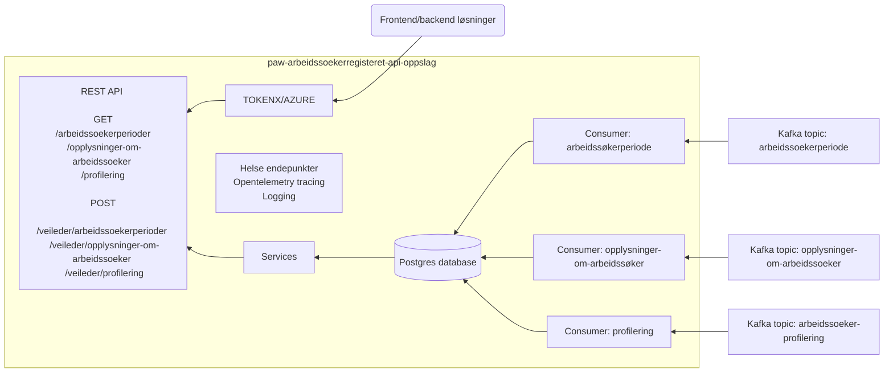

# paw-arbeidssoekerregisteret-api-oppslag

REST-api for oppslag i arbeidssøkerregisteret

## Dokumentasjon for API

https://oppslag-arbeidssoekerregisteret.intern.dev.nav.no/docs

## Flytdiagram



## Autentisering

Kall til API-et er autentisert med Bearer token fra TokenX eller Azure.
Eksempel: `Authorization: Bearer <token>`

### TOKENX
For oppslag som gjøres av arbeidssoker selv:
- `/arbeidssoekerperioder`
- `/opplysninger-om-arbeidssoeker/{periodeId}`
- `/profilering/{periodeId}`
```json
{ "acr": "Level4", "pid": "<fnr>" }
```

### AZURE:
For oppslag som gjøres av veileder eller system:
- `/veileder/arbeidssoekerperioder`
- `/veileder/opplysninger-om-arbeidssoeker/{periodeId}`
- `/veileder/profilering/{periodeId}`

Token med veileder-ident:
```json
{
  "oid": "989f736f-14db-45dc-b8d1-94d621dbf2bb",
  "NAVident": "<veileder-ident>"
}
```
- Verifiserer veileders leserettigheter med [POAO-tilgang](https://github.com/navikt/poao-tilgang).

Machine-to-maching token:
```json
{
  "oid": "989f736f-14db-45dc-b8d1-94d621dbf2bb",
  "roles": ["access_as_application"]
}
```
- Krever ikke `NAVident` i tokenet og brukes kun av systemer.

## Teknologier

Øvrige teknologier, rammeverk og biblioteker som er blitt tatt i bruk:

- [**Kotlin**](https://kotlinlang.org/)
- [**Ktor**](https://ktor.io/)
- [**PostgreSQL**](https://www.postgresql.org/)
- [**Flyway**](https://flywaydb.org/)
- [**Gradle**](https://gradle.org/)

## Dev oppsett

1) Opprett dolly bruker

Gå til https://dolly.ekstern.dev.nav.no/testnorge og imporer en bruker fra test-norge

2) Opprett dolly bruker som arbeidssøker

Gå til https://arbeid.intern.dev.nav.no/arbeid/registrering og registrer bruker.

Vent litt.

3) Logg inn i tokenx-token-generator med test-id med din nye dolly bruker

Gå til https://tokenx-token-generator.intern.dev.nav.no/api/obo?aud=dev-gcp:paw:paw-arbeidssoekerregisteret-api-oppslag

* For `/veileder` endepunkter.

Logg inn med trygdeetatenbruker på https://azure-token-generator.intern.dev.nav.no/api/obo?aud=dev-gcp:paw:paw-arbeidssoekerregisteret-api-oppslag

4) Gjør kall mot API-et

Bruk `access_token` i "Token Response" (fra steg 3) til å gjøre forespørsler mot https://oppslag-arbeidssoekerregisteret.intern.dev.nav.no

Eksempel:

```sh
$ curl https://oppslag-arbeidssoekerregisteret.intern.dev.nav.no/api/v1/arbeidssoekerperioder -H 'Authorization: Bearer <access_token>'
```

## Lokalt oppsett

Under er det satt opp et par ting som må på plass for at applikasjonen og databasen skal fungere.

### JDK 21

JDK 21 må være installert. Enkleste måten å installere riktig versjon av Java er ved å
bruke [sdkman](https://sdkman.io/install).

### Docker

`docker` og `docker-compose` må være installert. For å
installere disse kan du følge oppskriften på [Dockers](https://www.docker.com/) offisielle side. For installering på Mac
trykk [her](https://docs.docker.com/desktop/mac/install/) eller
trykk [her](https://docs.docker.com/engine/install/ubuntu/) for Ubuntu.

Man må også installere `docker-compose` som en separat greie
for [Ubuntu](https://docs.docker.com/compose/install/#install-compose-on-linux-systems). For Mac følger dette med når
man installerer Docker Desktop.

Kjør opp docker containerne med

```sh
docker-compose up -d
```

Se at alle kjører med

```sh
docker ps
```

Fem containere skal kjøre; kakfa, zookeeper, schema-registry, postgres og mock-oauth2-server.

### Gradle properties

Generer et PAT (personal access token) i github [her](https://github.com/settings/tokens).

Gi tokenet minimum read rettigheter -> kopier tokenet -> Autoriser gjennom navikt.

Legg til denne linjen i ```gradle.properties```:

```githubPassword=<github-personal-access-token>```

### App

Start app med `./gradlew run` eller start via intellij

### Autentisering

For å kalle APIet lokalt må man være autentisert med et Bearer token.

Vi benytter mock-oauth2-server til å utstede tokens på lokal maskin. Følgende steg kan benyttes til å generere opp et token:

1. Sørg for at containeren for mock-oauth2-server kjører lokalt (docker-compose up -d)
2. Naviger til [mock-oauth2-server sin side for debugging av tokens](http://localhost:8081/default/debugger)
3. Generer et token
4. Trykk på knappen Get a token
5. Skriv inn noe random i "Enter any user/subject" og pid i optional claims, f.eks.

```json
{ "acr": "Level4", "pid": "18908396568" }
```

For veileder:
```json
{
  "oid": "989f736f-14db-45dc-b8d1-94d621dbf2bb",
  "NAVident": "test"
}
```

For veileder med system-token:
Hvis du skal teste verifisering av tilgang for NavIdent, kan du legge til `Nav-Ident` i header på request.

```json
{
  "oid": "989f736f-14db-45dc-b8d1-94d621dbf2bb",
  "roles": ["access_as_application"]
}
```

6. Trykk Sign in
7. Kopier verdien for access_token og benytt denne som Bearer i Authorization-header

8. Eksempel:

```sh
$ curl localhost:8080/api/v1/arbeidssoekerperioder -H 'Authorization: Bearer <access_token>'
```

eller benytt en REST-klient (f.eks. [insomnia](https://insomnia.rest/) eller [Postman](https://www.postman.com/product/rest-client/))

## Kafka

Kafka UI ligger i docker-compose, og finnes på http://localhost:9000

### Produser kafkameldinger for lokal utvikling

Kjør `./gradlew produceLocalMessagesForTopics`

Denne tasken sender to meldinger til `arbeidssokerperioder-v1`, en melding til `opplysninger-om-arbeidssoeker-v1` og en melding til `arbeidssoker-profilering-v1`.

### Consumer

Konsumer meldinger fra `arbeidssokerperioder-v1`

```sh
docker exec -it paw-arbeidssoekerregisteret-api-oppslag_kafka_1 /usr/bin/kafka-console-consumer --bootstrap-server 127.0.0.1:9092 --topic arbeidssokerperioder-v1
```

Konsumer meldinger fra `opplysninger-om-arbeidssoeker-v1`

```sh
docker exec -it paw-arbeidssoekerregisteret-api-oppslag_kafka_1 /usr/bin/kafka-console-consumer --bootstrap-server 127.0.0.1:9092 --topic opplysninger-om-arbeidssoeker-v1
```

Konsumer meldinger fra `arbeidssoker-profilering-v1`

```sh
docker exec -it paw-arbeidssoekerregisteret-api-oppslag_kafka_1 /usr/bin/kafka-console-consumer --bootstrap-server 127.0.0.1:9092 --topic arbeidssoker-profilering-v1
```

## Deploye kun til dev

Ved å prefikse branch-navn med `dev/`, så vil branchen kun deployes i dev.

```
git checkout -b dev/<navn på branch>
```

evt. rename branch

```
git checkout <opprinnlig-branch>
git branch -m dev/<opprinnlig-branch>
```

# Henvendelser

Spørsmål knyttet til koden eller prosjektet kan stilles via issues her på github.

## For NAV-ansatte

Interne henvendelser kan sendes via Slack i kanalen [#team-paw-dev](https://nav-it.slack.com/archives/CLTFAEW75)

# Lisens

[MIT](LICENSE)

